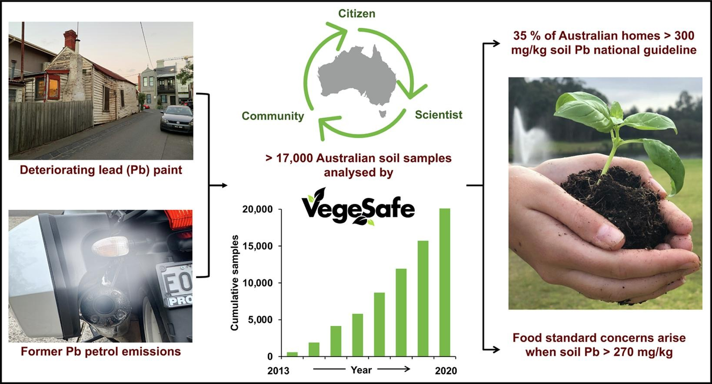

## Abstract

We launched the VegeSafe program in 2013 to assist Australians concerned about exposure to contaminants in their soils and gardens. VegeSafe analyses garden soils provided by citizens for trace metals at our laboratory at little to no cost, with easy-to-follow guidance on any intervention required. The response was overwhelming—Australians submitted 17,256 soils from 3,609 homes, and in turn VegeSafe researchers now have unparalleled household-scale data, providing new insights into urban trace metal contamination. The results are sobering, with 35% of homes, particularly those that are older, painted and located in inner cities having soils above the Australian residential guideline (300 mg/kg) for the neurotoxic trace metal lead (Pb). Exposure pathway, blood Pb concentration and vegetable uptake modelling showed the communities in these locations were most at risk. VegeSafe is transformative: 94% of participants better understood contaminants, 83% felt safer in their home environment and 40% undertook remedial action based on their results. The two-way nature of this program enables education of citizens about environmental contaminants, advances public health, and delivers impactful science.

## Keywords

Trace metals; Exposure; Human health; Soil