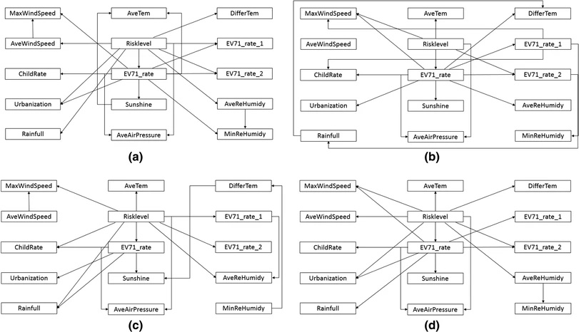

## Abstract

Hand, foot, and mouth disease (HFMD) is a global infectious disease resulting in millions of cases and even hundreds of deaths. Although a newly developed formalin-inactivated EV71 (FI-EV71) vaccine is effective against EV71, which is a major pathogen for HFMD, no vaccine against HFMD itself has yet been developed. Therefore, establishing a sensitive and accurate early warning system for HFMD is important. The early warning model for HFMD in the China Infectious Disease Automated-alert and Response System combines control chart and spatial statistics models to detect spatiotemporal abnormal aggregations of morbidity. However, that type of early warning for HFMD just involves retrospective analysis. In this study, we apply a Bayesian belief network (BBN) to estimate the increased risk of death and severe HFMD in the next month based on pathogen detection and environmental factors. Hunan province, one of the regions with the highest prevalence of HFMD in China, was selected as the study area. The results showed that compared with the traditional early warning model for HFMD, the proposed method can achieve a very high performance evaluation (the average AUC tests were more than 0.92). The model is also simple and easy to operate. Once the structure of the BBN is established, the increased risk of death and severe HFMD in the next month can be estimated based on any one node in the BBN.
