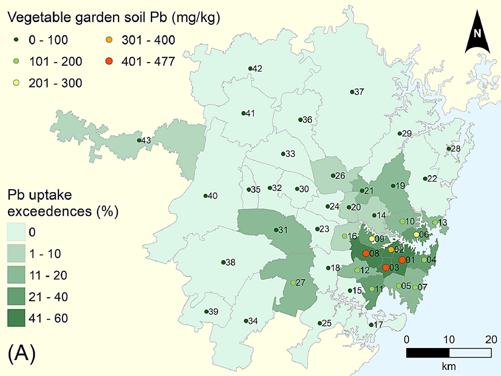

## Abstract

Here we detail the soil to vegetable transfer factor (uptake) data and calculation procedures for vegetable trace metal uptake estimation that are presented in Taylor et al. (2021).

Firstly, we present the literature review of trace metal uptake data, describing uptake from soil to vegetable produce determined in global experimental studies. After selecting the uptake factors most applicable to the VegeSafe dataset, using similar soil trace metal concentrations and studies that consider only the edible parts of plants, we applied these uptake factors to VegeSafe soils. Using this approach, we were able to estimate trace metal concentrations in home grown produce across the 3,609 homes included in our VegeSafe study.

Using Australian and global food standards, we calculated the soil trace metal concentrations that would potentially result in exceedance of Australian and global food safety criteria. Our process followed the method detailed in the Australian soil guidelines (NEPM, 2013). Also presented are the numbers of individual samples and vegetable gardens that are likely to exceed food safety criteria in the three largest cities of Australia: Sydney, Melbourne and Brisbane. Individual household vegetable garden trace metal uptake data were aggregated across standarised geographic areas (Statistical Area Level 3) as established by the Australian Bureau of Statistics to visualise the geospatial distribution of potential trace metal risk from home produce.

These modelled data provide the basis for prioritising locations, trace metals and soils for future empirically-based studies of trace metal contamination in home-grown produce.

## Keywords

Trace metals; Vegetable uptake; Human health; Soil