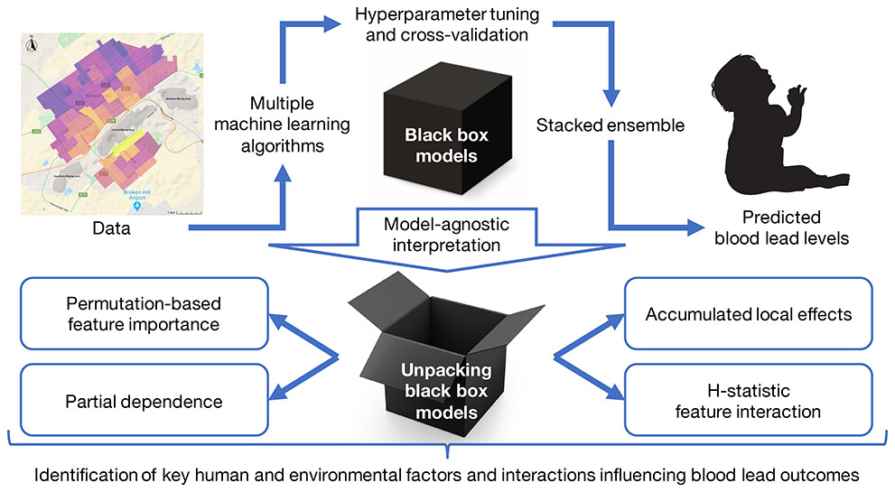

## Abstract

Blood lead (Pb) poisoning remains a global concern, particularly for children in their early developmental years. Broken Hill is Australia’s oldest operating silver–zinc–lead mine. In this study, we utilized recent advances in machine learning to assess multiple algorithms and identify the most optimal model for predicting childhood blood Pb levels (BLL) using Broken Hill children’s (<5 years of age) data (n = 23,749) from 1991 to 2015, combined with demographic, socio-economic, and environmental influencing factors. We applied model-agnostic methods to interpret the most optimal model, investigating different environmental and human factors influencing childhood BLL. Algorithm assessment showed that stacked ensemble, a method for automatically and optimally combining multiple prediction algorithms, enhanced predictive performance by 1.1% with respect to mean absolute error (p < 0.01) and 2.6% for root-mean-squared error (p < 0.01) compared to the best performing constituent algorithm (random forest). By interpreting the model, the following information was acquired: children had higher BLL if they resided within 1.0 km to the central mine area or 1.37 km to the railroad; year of testing had the greatest interactive strength with all other factors; BLL increased faster in Aboriginal than in non-Aboriginal children at 9–10 and 12–18 months of age. This “stacked ensemble + model-agnostic interpretation” framework achieved both prediction accuracy and model interpretability, identifying previously unconnected variables associated with elevated childhood BLL, offering a marked advantage over previous works. Thus, this approach has a clear value and potential for application to other environmental health issues.

## Keywords

Pb exposure; childhood exposures; mining contamination; ethnic disparities; modelling methods; stacked ensemble; black-box model interpretation
