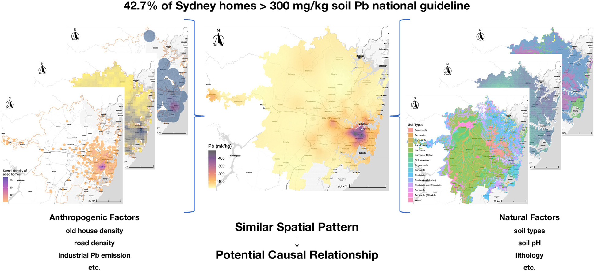

## Highlights

* Optimal parameter-based geographical detector modelled contamination in 1828 homes.

* Applied and compared novel spatial analysis frameworks using machine learning.

* House age, paint, home and road density, industrial emissions influence soil metals.

* Combined anthropogenic and natural factors generate stronger interactive effects.

* 42.7 % of study homes had soils above Australia's residential Pb 300 mg/kg guideline.

## Abstract

Australia's national citizen science program VegeSafe has collected and analysed over 26,000 residential garden soil samples for their trace metal concentrations, enabling a more comprehensive understanding of the factors influencing contamination. Here we analysed spatial data from 8221 soil samples collected from 1828 homes across Greater Sydney, Australia's largest city, using an optimal parameter-based geographical detector (OPGD) model to quantify anthropogenic and natural factors influencing urban residential soil trace metal concentrations. The OPGD model identifies optimal spatial scales and discretization parameters, enhancing spatial stratified heterogeneity analysis. Results demonstrate anthropogenic factors, such as aged/painted home density, road density, and industrial trace metal emissions, primarily contribute to soil concentrations of arsenic (As), cadmium (Cd), chromium (Cr), copper (Cu), lead (Pb), and zinc (Zn). By contrast, natural factors including soil pH, regolith stability, and soil type dominate soil manganese (Mn) and nickel (Ni) concentrations. Strongest interactive effects typically involve an anthropogenic and a natural factor. Notably, 42.7 % of homes within the study area had at least one soil sample with Pb concentrations exceeding the Australian residential guideline of 300 mg/kg. Locations with potential risk of harm are identified to inform targeted mitigation strategies. Compared to machine learning methods, the OPGD model offers a more reliable and comprehensive assessment of urban residential soil trace metal contamination.

## Keywords

Lead (Pb) exposure; Anthropogenic factors; Natural factors; Risk assessment; GIS; Spatial heterogeneity analysis; Geo-detector; Machine learning
